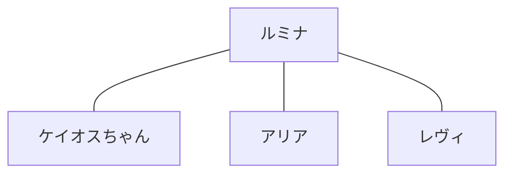

# 04 キャラクター

- **ステータス**: ドラフト(4名の基本設定づくりが最優先)
- **最終更新**: 2026-07-16

この章はキャラクター体系の「公式サマリー」です。
各キャラクターの詳細プロフィールは [Character Bible](../character-bible/) で管理し、ここでは一覧・関係性・共通ルールを定義します。

## キャラクター一覧

| ID | 名前 | 英語名 | 役割 | ステータス | 詳細 |
|---|---|---|---|---|---|
| CHR-001 | ルミナ | Lumina | ブランドの象徴。光の案内役(仮) | 設定中 | [lumina.md](../character-bible/characters/lumina.md) |
| CHR-002 | ケイオスちゃん | Chaos-chan | 混沌・揺らぎの担当(仮) | 設定中 | [chaos-chan.md](../character-bible/characters/chaos-chan.md) |
| CHR-003 | アリア | Aria | (未設定) | 設定中 | [aria.md](../character-bible/characters/aria.md) |
| CHR-004 | レヴィ | Levi | (未設定) | 設定中 | [levi.md](../character-bible/characters/levi.md) |

新キャラクターは CHR-005 以降の ID を割り当て、この表に必ず追記する。

## キャラクター設計の共通ルール

1. すべてのキャラクターはブランド理念「安心・癒し・希望・心を整理する時間」に貢献する役割を持つ
2. 「完全な悪役」は作らない。ケイオスちゃんのような揺らぎの存在も、利用者の心に寄り添う側にいる
3. 利用者を否定・叱責・脅すセリフは書かない(→ [08_ライティングガイドライン](./08_writing-guidelines.md))
4. 外見・口調・一人称・二人称は Character Bible で固定し、媒体間で揺らさない
5. キャラクター間の関係性を変更する場合は、本章と Character Bible の両方を更新する

## 関係図

<!-- TODO: 4名の関係が決まったら記述する -->

(仮: 関係性の線の意味は未定義)

## カードとの関係

- キャラクターが描かれるカードは、Card Database 側の「象徴」欄にキャラIDを記載する
- キャラクターの設定変更がカード文言に影響する場合、[06_カードマスター](./06_card-master.md) で影響範囲を確認する

## 更新履歴

| 日付 | 版 | 内容 |
|---|---|---|
| 2026-07-16 | v0.1 | 章の骨組みと4キャラの枠を作成 |
